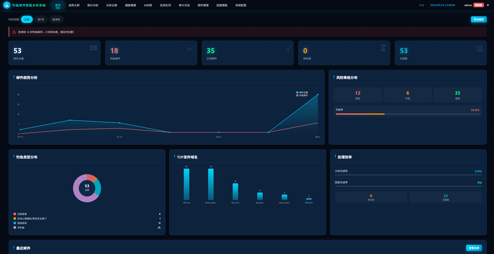
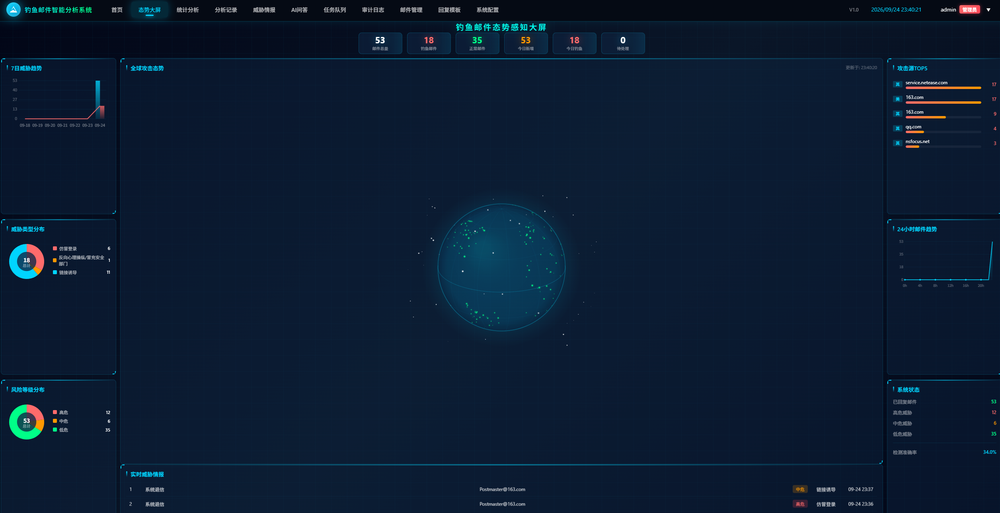
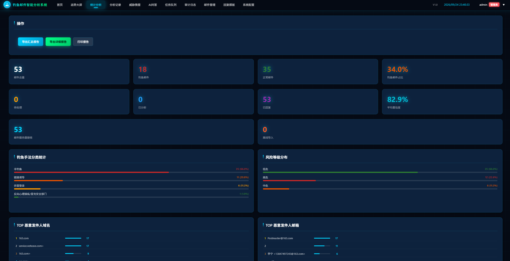
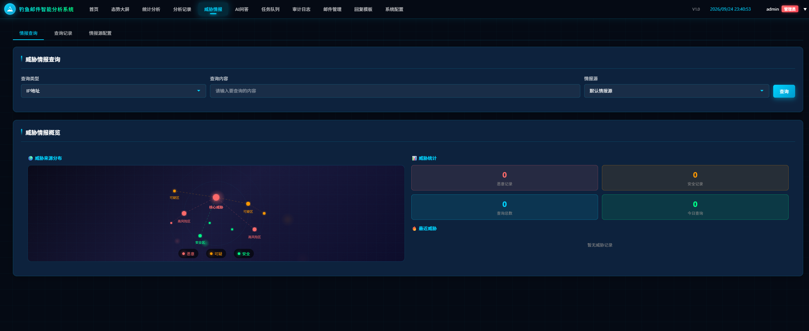
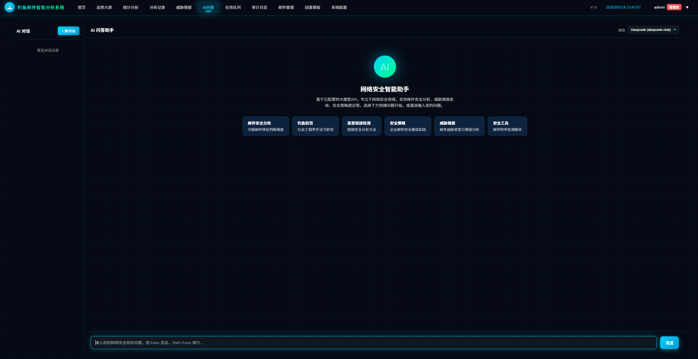
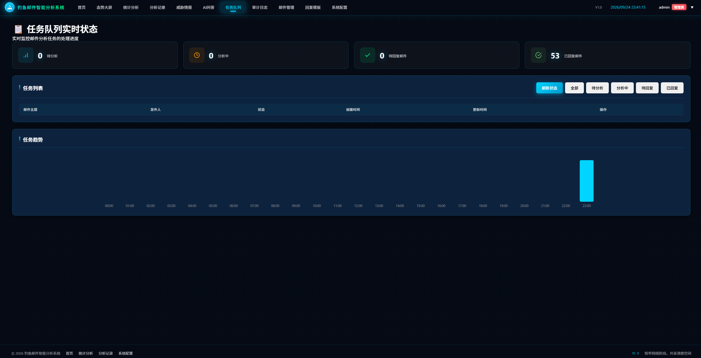

# 钓鱼邮件智能分析系统

基于 AI 大模型的钓鱼邮件智能分析系统。

**核心功能：自动收取邮件 → AI 深度研判 → 自动回复发件人，告知该邮件是否为钓鱼邮件及对应处置建议**，帮助发件人及时识别风险、采取正确处置。同时支持威胁情报、统计分析、态势大屏等功能，支持在 Linux 环境下一键部署运行。

## 核心工作流

收取邮件 → AI 智能研判 → 判定是否钓鱼 → 自动回复发件人

系统分析完成后，会自动向邮件发送者回复一封邮件，内容包括：

- **判定结果**：该邮件是「钓鱼邮件」还是「正常邮件」
- **分析依据**：置信度、风险等级、钓鱼类型、特征指标
- **安全风险提示**：针对性处置建议（勿点击链接/附件、删除邮件、已点击的应急处置等）
- **原始邮件信息**：便于发件人核对

## 功能特性

- **邮件自动收取**：支持 IMAP 收取邮件，可对接 Foxmail 本地存储
- **AI 智能分析**：调用大模型对邮件进行钓鱼研判，输出判定结果、分析依据、风险等级、置信度
- **自动回复**：分析完成后自动回复发件人处置建议（支持自定义发件人名称）
- **任务队列**：基于 Redis 的并发分析/回复任务队列，支持实时状态监控
- **威胁情报**：威胁情报接入与可视化展示
- **统计分析**：多维统计报表与进度可视化
- **AI 问答**：支持图片上传的智能问答
- **多用户权限**：管理员 / 普通用户角色，审计日志追踪
- **态势大屏**：安全态势可视化展示

## 系统截图

| 界面截图 | 界面截图 | 界面截图 |
| :---: | :---: | :---: |
|  |  |  |
|  |  |  |

## 技术架构

| 组件 | 用途 |
| ---- | ---- |
| Flask | Web 后端框架 |
| MySQL / MariaDB | 业务数据存储 |
| Redis | 任务队列与缓存 |
| Nginx | 反向代理（80 -> 8080） |
| Python 3 | 运行语言 |

## 系统要求

- Linux 服务器（支持 Debian / Ubuntu / CentOS / RHEL / Rocky / AlmaLinux 等）
- 内存建议 2GB 及以上
- 磁盘建议 20GB 及以上
- 需要 root 权限执行安装

> **重要提示**：强烈建议使用**纯净版（全新安装）的 Linux 系统**进行部署，避免已预装的 MySQL / Redis / Nginx 等组件占用端口（80、3306、6379 等）导致冲突。若系统已预装上述组件，请先停止或卸载，或调整端口后重试。

## 一键安装（推荐）

在项目根目录执行：

```bash
sudo bash install.sh
```

脚本会交互式提示输入数据库密码、Redis 密码。如需无人值守自动化部署，可用环境变量传入：

```bash
sudo DB_PASSWORD='你的数据库密码' REDIS_PASSWORD='你的Redis密码' bash install.sh
```

> 依赖安装默认使用国内 PyPI 镜像（清华）加速；海外环境可设 `PIP_INDEX_URL=https://pypi.org/simple` 覆盖。

脚本会自动完成以下所有步骤：

1. 自动检测操作系统与包管理器（apt / yum / dnf）
2. 自动安装 Python3、MariaDB、Redis、Nginx 及编译依赖
3. 交互式提示输入数据库密码、Redis 密码（留空自动生成/不设密码）
4. 自动创建数据库 `phishing_agent` 和用户 `phishing` 并授权
5. 创建 Python 虚拟环境并安装依赖
6. 生成 `.env` 配置文件
7. 创建并启动 systemd 服务 `phishing-agent`
8. 配置 Nginx 反向代理（80 端口）

安装完成后访问：

```
http://<服务器IP>
```

**默认管理员账号**：`admin` / `admin`（首次登录后请立即修改）。

## 手动部署（自行安装组件）

如果你希望手动安装 MySQL / Redis / Nginx，只需保证以下组件可用，然后修改 `.env` 即可：

1. 安装 Python 3.8+ 与 pip
2. 安装并启动 MySQL/MariaDB、Redis、Nginx
3. 复制 `.env.example` 为 `.env`，填写你的数据库与 Redis 密码：

```bash
cp .env.example .env
vi .env
```

`.env` 中可配置的项：

| 变量 | 说明 | 示例 |
| ---- | ---- | ---- |
| `MYSQL_HOST` | 数据库地址 | localhost |
| `MYSQL_PORT` | 数据库端口 | 3306 |
| `MYSQL_USER` | 数据库用户 | phishing |
| `MYSQL_PASSWORD` | 数据库密码 | 你的密码 |
| `MYSQL_DATABASE` | 数据库名 | phishing_agent |
| `REDIS_HOST` | Redis 地址 | localhost |
| `REDIS_PORT` | Redis 端口 | 6379 |
| `REDIS_PASSWORD` | Redis 密码（无密码留空） | 你的密码 |

4. 创建数据库并授权：

```sql
CREATE DATABASE IF NOT EXISTS phishing_agent CHARACTER SET utf8mb4 COLLATE utf8mb4_unicode_ci;
CREATE USER IF NOT EXISTS 'phishing'@'localhost' IDENTIFIED BY '你的密码';
GRANT ALL PRIVILEGES ON phishing_agent.* TO 'phishing'@'localhost';
FLUSH PRIVILEGES;
```

5. 安装 Python 依赖并启动：

```bash
python3 -m venv venv
source venv/bin/activate
pip install -r requirements.txt
python main.py
```

6. （可选）配置 Nginx 反向代理：将 `deploy/nginx.conf` 复制到 Nginx 配置目录。

7. （可选）配置 systemd 服务：将 `deploy/phishing-agent.service` 复制到 `/etc/systemd/system/` 并修改其中的路径。

> 说明：应用首次启动时会自动创建所有数据表，无需手动导入 SQL。`deploy/schema.sql` 为数据库表结构参考备份，如需手动初始化可执行 `mysql -u root -p phishing_agent < deploy/schema.sql`。

## 数据库表结构

`deploy/schema.sql` 为导出的完整数据库表结构（不含业务数据）。应用启动时会自动建表，一般无需手动导入。

## 目录结构

```
.
├── main.py                 # 服务入口
├── config.py               # 基础配置
├── requirements.txt        # Python 依赖
├── install.sh              # 一键安装脚本
├── .env.example            # 环境变量示例
├── deploy/
│   ├── phishing-agent.service   # systemd 服务
│   ├── nginx.conf               # Nginx 反代配置
│   └── schema.sql               # 数据库表结构
└── src/
    ├── api/                # 路由与接口
    ├── models/             # 数据模型
    ├── services/           # 业务服务
    ├── templates/          # 前端模板
    └── utils/              # 工具类
```

## 服务管理

```bash
# 查看服务状态
systemctl status phishing-agent

# 查看应用日志
journalctl -u phishing-agent -f

# 重启服务
systemctl restart phishing-agent

# 停止服务
systemctl stop phishing-agent
```

## 常见问题

**Q：安装后无法访问 80 端口？**
A：确认防火墙已放行 80 端口：`firewall-cmd --add-port=80/tcp --permanent && firewall-cmd --reload`（CentOS）或 `ufw allow 80`（Ubuntu）。

**Q：数据库密码忘记了？**
A：查看 `/opt/phishing-email-analysis-system/.env` 文件中的 `MYSQL_PASSWORD`。

**Q：如何修改数据库密码？**
A：修改 `.env` 中 `MYSQL_PASSWORD`，同时在数据库中修改用户密码，然后重启服务。

**Q：Redis 无密码模式安全吗？**
A：脚本默认 Redis 仅监听本机（127.0.0.1），外部无法访问。如需更强安全，安装时设置 Redis 密码。

## Docker 部署（可选）

如果你更喜欢用 Docker，无需手动安装 MySQL / Redis / Nginx：

```bash
# 可选：复制环境变量并修改密码
cp .env.example .env

# 构建并后台启动（MySQL + Redis + 应用）
docker compose up -d --build

# 查看日志
docker compose logs -f app

# 停止
docker compose down
```

启动后访问 `http://<服务器IP>:8080`（默认账号 `admin` / `admin`）。默认数据库密码为 `phishing123456`，可通过 `.env` 中的 `MYSQL_PASSWORD`、`MYSQL_ROOT_PASSWORD`、`REDIS_PASSWORD` 覆盖。

## 更新日志（修复说明）

以下关键修复均已内置到当前版本：

### 部署兼容性修复

1. **PyPI 镜像源**：国内服务器无法直连 PyPI，安装脚本默认使用清华镜像加速依赖下载（可用 `PIP_INDEX_URL` 覆盖）。
2. **Windows/Linux 跨平台兼容**：`foxmail_service.py` 中的 `winreg`、`ctypes.wintypes` 为 Windows 专用模块，已做跨平台兼容处理，避免 Linux 启动崩溃。
3. **依赖补全**：`requirements.txt` 补充 `Pillow`（图片处理）与 `python-docx`（Word 报告导出）两个缺失依赖。
4. **端口双重绑定修复**：`main.py` 原先手动 `bind(8080)` 后又由 `make_server` 二次绑定，Linux 下报 "Address already in use"，已改为直接使用 `make_server`。
5. **重复部署密码同步**：`install.sh` 使用 `ALTER USER` 强制同步数据库用户密码，避免重复部署时新旧密码不一致导致认证失败。

### 数据存储修复

6. **邮件内容超长修复**：`email_record.raw_content` 等列由 `TEXT`（64KB）升级为 `LONGTEXT`（4GB）/ `MEDIUMTEXT`（16MB），修复邮件原始内容超长导致的 "Data too long" 报错与自动分析失效问题。应用启动时会自动迁移已有数据库的列类型。

## 开源协议

本项目基于 [MIT License](LICENSE) 开源。
